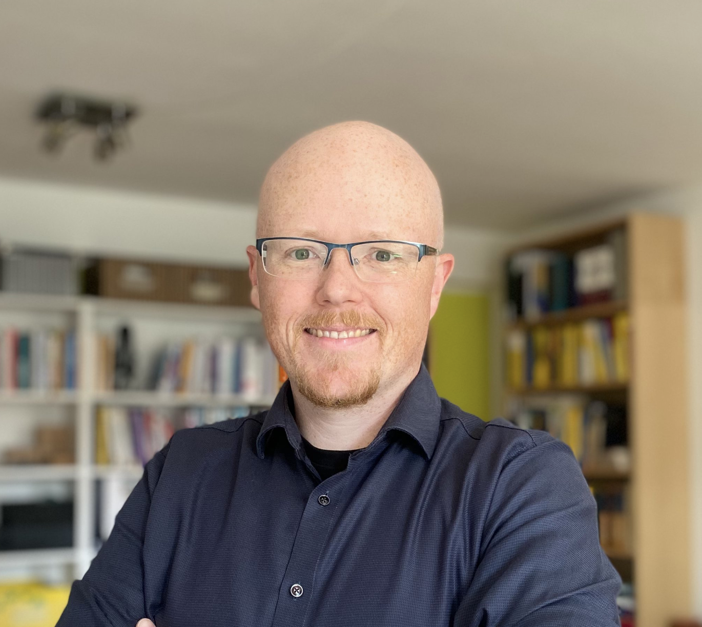

# Dr. Heinrich Hartmann

  
  
Dr. Heinrich Hartmann

  
Mathematics & Engineering

  <a href="https://mastodon.social/@hhartmann" style="color: #6364ff; text-decoration: none;">@hhartmann@mastodon.social</a>

Heinrich Hartmann is an independent self-funded mathematician whose work spans
algebraic geometry, applied mathematics, and large-scale observability systems.

  Follow my research on Mastodon: <a href="https://mastodon.social/@hhartmann" style="color: #6364ff;">@hhartmann</a>

## Positions

- **[University of Mainz](https://www.uni-mainz.de/)**, with [Manfred Lehn](https://www.mathematik.uni-mainz.de/Members/lehn/) — Diploma (2007)
  [*Nodale Kurven und Hilbertschemata*](https://www.heinrichhartmann.com/pdf/Heinrich%20Hartmann%20-%20Nodale%20Kurven%20und%20Hilbertschemata%20%28Diplomarbeit,%20Mainz%202007%29.pdf)

- **[University of Bonn](https://www.uni-bonn.de/)**, with [Daniel Huybrechts](https://en.wikipedia.org/wiki/Daniel_Huybrechts) — PhD (2008-2011)
  [*Mirror Symmetry and Stability Conditions on K3 Surfaces*](https://bonndoc.ulb.uni-bonn.de/xmlui/handle/20.500.11811/5012)

- **[University of Oxford](https://www.ox.ac.uk/)**, with [Tom Bridgeland](https://en.wikipedia.org/wiki/Tom_Bridgeland) — Research Fellowship (2012–2013)

- **[University of Koblenz-Landau](https://www.uni-koblenz.de/)**, with [Stefan Staab](https://www.uni-koblenz.de/en/profile/staab) — Research Fellow (2013–2015)

## Publications

- [Google Scholar Profile](https://scholar.google.com/citations?user=slifJ6MAAAAJ&hl=en) — 183 citations, h-index: 5 (July 2026)

#### Algebraic Geometry & Mirror Symmetry

- **[Cusps of the Kähler Moduli Space and Stability Conditions on K3 Surfaces](https://arxiv.org/pdf/1012.3121)** <a href="https://scholar.google.com/scholar?oi=bibs&hl=en&cites=5332367968998705355">36 citations</a>
  *Mathematische Annalen* 354(1), 2012.

    Relates boundary points (“cusps”) in the K3 moduli space to Bridgeland stability conditions on derived categories, giving a precise picture of how stability behaves near the boundary. The appendix has become a standard reference for perfect complexes and complex base-change; Proposition 6.4 is frequently cited as the canonical base-change result.

- **[Period- and Mirror-Maps for the Quartic K3](https://link.springer.com/article/10.1007/s00229-012-0577-7)** <a href="https://scholar.google.com/scholar?oi=bibs&hl=en&cites=987117995914775430">13 citations</a>
  *manuscripta mathematica* 141(3), 2013.

    Gives a complete, explicit treatment of mirror symmetry for the quartic K3, computing period maps and Picard–Fuchs equations and matching complex and Kähler moduli. It is widely used as the standard reference for the quartic K3 mirror example in later work on K3 surfaces.

#### Applied Mathematics & Engineering

- **[Circllhist—A Log-Linear Histogram Data Structure for IT Infrastructure Monitoring](https://arxiv.org/abs/2001.06561)** <a href="https://scholar.google.com/scholar?oi=bibs&hl=en&cites=10979968214060104780">2 citations</a>
  *arXiv preprint arXiv:2001.06561*, 2020. — [OpenHistogram.io](https://openhistogram.io/) | [Circonus Press Release](https://www.prnewswire.com/news-releases/circonus-contributes-its-powerful-patented-histogram-technology-to-the-open-source-community-301240239.html)

    Introduces the circllhist log-linear histogram, designed for accurate percentile estimation on high-volume latency data with bounded error and mergeability across nodes. The design underlies OpenHistogram and influenced the CNCF OpenTelemetry exponential histogram specification.

- **[Statistics for Engineers: Applying Statistical Techniques to Operations Data](https://scholar.google.com/citations?view_op=view_citation&hl=en&user=slifJ6MAAAAJ&citation_for_view=slifJ6MAAAAJ:zYLM7Y9cAGgC)** <a href="https://scholar.google.com/scholar?oi=bibs&hl=en&cites=12244209595412640380">5 citations</a>
  *ACM Queue* 14(1), 2016.

    Expository piece aimed at reliability and operations engineers, showing how to apply statistical tools (quantiles, confidence intervals, hypothesis tests) correctly to telemetry data. It distills a multi-year conference tutorial into a single, practical reference.

#### Digital Democracy & Computational Social Science

- **[Voting Behaviour and Power in Online Democracy: A Study of LiquidFeedback in Germany's Pirate Party](https://scholar.google.com/citations?view_op=view_citation&hl=en&user=slifJ6MAAAAJ&citation_for_view=slifJ6MAAAAJ:qjMakFHDy7sC)** <a href="https://scholar.google.com/scholar?oi=bibs&hl=en&cites=7058081408371622826,1330146067348447434">104 citations</a>
  *Proceedings of the International AAAI Conference on Web and Social Media*, 2015.

    Empirical study of voting behavior and power concentration in the Pirate Party’s LiquidFeedback platform, providing one of the first large-scale analyses of liquid democracy in practice. Widely cited in computational social science.

- **[Evaluating Reference String Extraction Using Line-Based Conditional Random Fields](https://link.springer.com/chapter/10.1007/978-3-319-44066-8_15)** <a href="https://scholar.google.com/scholar?oi=bibs&hl=en&cites=10926418619359472716">21 citations</a>
  M. Körner, B. Ghavimi, P. Mayr, H. Hartmann, S. Staab.
  *Advances in Databases and Information Systems (ADBIS)*, 2016.

    Applies conditional random fields to extract structured reference metadata from German-language publications, demonstrating that sequence labelling methods can robustly recover citation fields in noisy real-world documents.

### Fellowships

- [Kyoto University](https://www.kyoto-u.ac.jp/en) - Visiting Scientist (2011)
- [MIT Talbot Workshop](https://math.mit.edu/events/talbot/index.php?year=2009) - Participant (2009)
- [HIM Research Institute, Bonn](https://www.mathematics.uni-bonn.de/him) - PhD Scholarship
- [Studientstiftung des Deutschen Volkes](https://www.studienstiftung.de/) - Scholarship

